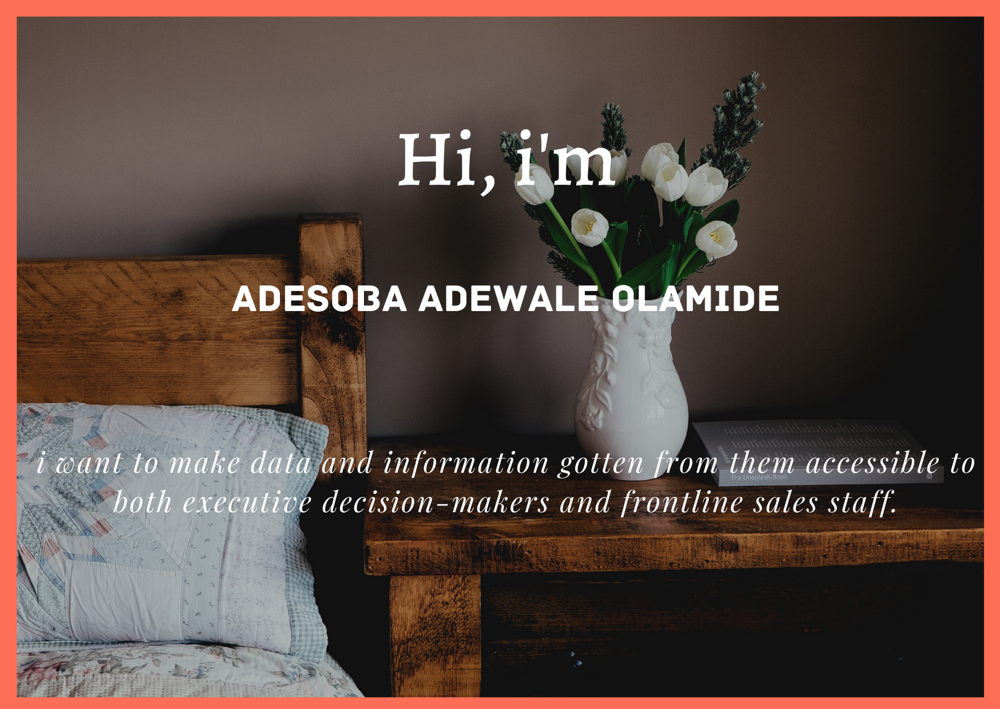

## Hello👋🏾. Thank you for visiting my profile 👩🏾‍💻

As a Data analyst and scientist, i am versatile in building models that translate data points into business insights using various data analytic and visualization tools. I like to
explore the relationships between numbers, and translate digits and spreadsheets into stories. In the age of big data, these stories become actionable solutions and strategies for businesses, and I take pride in my ability to make data accessible to both executive decision-makers and frontline sales staf.

I am experienced in machine learning, supervised algorithms and use data visualization techniques to present the results. I use SQL, Python, Microsoft PowerBI and Tableau for my data projects and am very good in debugging.

## Find me around the web 🌎:  
- Sharing updates on [LinkedIn](https://www.linkedin.com/in/fortune-uwha)

<!--
**fortune-uwha/fortune-uwha** is a ✨ _special_ ✨ repository because its `README.md` (this file) appears on your GitHub profile.

Here are some ideas to get you started:

- 🔭 I’m currently working on ...
- 🌱 I’m currently learning ...
- 👯 I’m looking to collaborate on ...
- 🤔 I’m looking for help with ...
- 💬 Ask me about ...
- 📫 How to reach me: ...
- 😄 Pronouns: ...
- ⚡ Fun fact: ..
